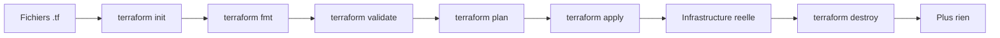
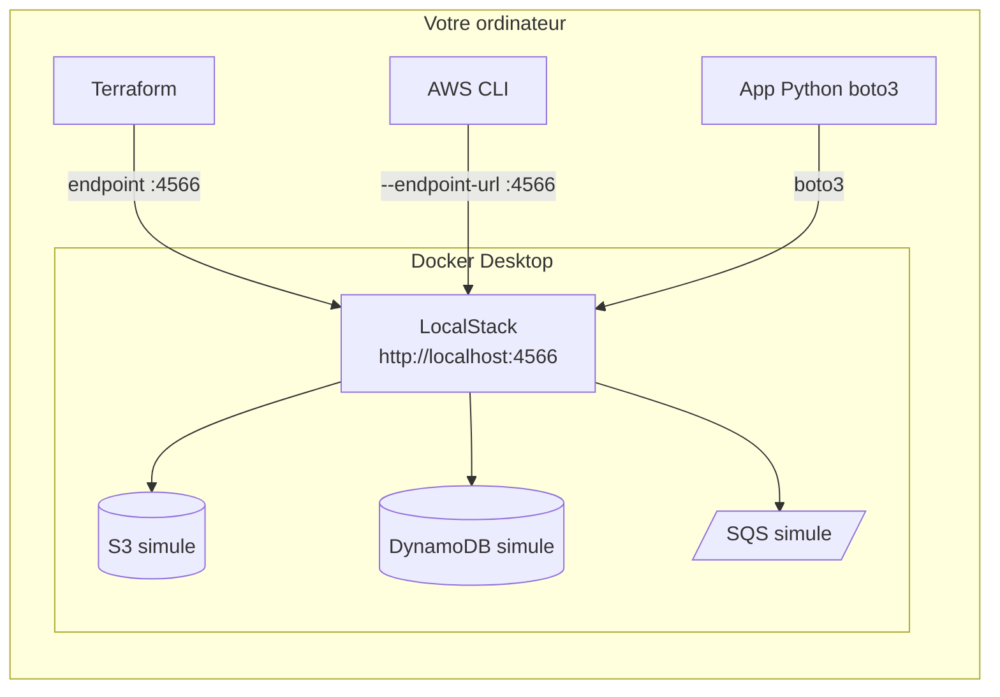
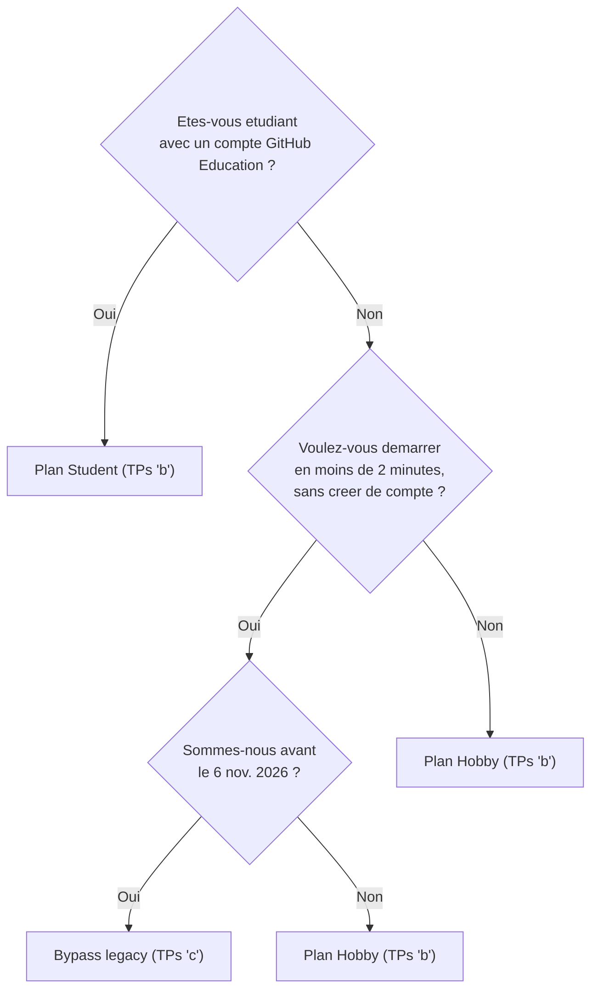

<a id="top"></a>

# Chapitre 0 — Théorie : Terraform, LocalStack, et les plans 2026

> **Objectif :** comprendre **quoi** est Terraform, **quoi** est LocalStack, **pourquoi** on les utilise ensemble, et quelles sont les **options d'abonnement** LocalStack (gratuites ou non).
>
> Ce document est purement théorique : aucune installation, aucun code à exécuter. Il prépare les TPs pratiques qui suivent.

---

## Table des matières

| # | Section |
|---|---|
| 1 | [Qu'est-ce que Terraform ?](#terraform) |
| 2 | [Qu'est-ce que LocalStack ?](#localstack) |
| 3 | [Pourquoi Terraform + LocalStack ?](#pourquoi-ensemble) |
| 4 | [Le contexte 2026 : changement de modèle LocalStack](#contexte-2026) |
| 5 | [Tableau comparatif des plans LocalStack](#plans-table) |
| 6 | [Quel plan choisir pour ce cours ?](#choix) |
| 7 | [Les deux parcours du cours : `b` (avec token) et `c` (sans token)](#parcours) |
| 8 | [Vocabulaire essentiel](#vocabulaire) |
| 9 | [Pour aller plus loin](#references) |

---

<a id="terraform"></a>

## 1. Qu'est-ce que Terraform ?

### 1.1 Définition

**Terraform** est un outil libre développé par HashiCorp qui permet de **décrire une infrastructure informatique dans des fichiers texte**, puis de la **créer, modifier et détruire** automatiquement.

On parle de **Infrastructure as Code (IaC)** : l'infrastructure (serveurs, bases de données, files de messages, réseaux…) est décrite dans du **code**, pas cliquée à la main dans une console web.

### 1.2 Pourquoi pas faire les clics manuellement ?

Sans Terraform :

```text
1. Je clique dans la console AWS pour creer un bucket S3.
2. Je clique pour creer une table DynamoDB.
3. Je clique pour creer une file SQS.
4. Si je veux 3 environnements (dev, test, prod), je clique 3 fois plus.
5. Si un collegue veut la meme infra, il doit cliquer pareil.
6. Personne ne sait exactement ce qui existe.
7. Si je supprime une ressource par erreur, je dois la recreer a la main.
```

Avec Terraform :

```text
1. J'ecris un fichier .tf qui declare ce que je veux.
2. Je lance `terraform apply` -> tout est cree automatiquement.
3. Pour un nouvel environnement, je change UNE variable.
4. Le code est versionne dans Git : tout le monde voit l'infra.
5. `terraform destroy` enleve tout proprement.
6. `terraform plan` montre ce qui va changer avant que ca change.
```

### 1.3 Les concepts clés

| Concept | Signification |
|---|---|
| **Provider** | Plugin qui sait parler à un fournisseur (AWS, Azure, GCP…). Dans ce cours : provider `aws` redirigé vers LocalStack. |
| **Resource** | Une chose qu'on veut créer (un bucket S3, une table DynamoDB…). |
| **Variable** | Valeur paramétrable (`project_name`, `environment`…). |
| **Output** | Valeur exposée après création (nom du bucket, URL de la file SQS…). |
| **State** | Fichier `terraform.tfstate` qui sait ce qui a déjà été créé. |
| **Module** | Code Terraform réutilisable (vous en ferez au TP 4). |
| **Plan** | Aperçu des changements avant application (`terraform plan`). |
| **Apply** | Exécution réelle des changements (`terraform apply`). |
| **Destroy** | Suppression de toutes les ressources gérées (`terraform destroy`). |

### 1.4 Le cycle Terraform



### 1.5 Pourquoi c'est important ?

- **Reproductible** : le même code donne la même infra, partout.
- **Versionné** : Git garde l'historique des changements.
- **Lisible** : un nouveau membre comprend l'infra en lisant le code.
- **Testable** : on peut valider l'infra avant de l'appliquer.
- **Multi-cloud** : la même logique vaut pour AWS, Azure, GCP, OpenStack, etc.

<p align="right"><a href="#top">↑ Retour en haut</a></p>

---

<a id="localstack"></a>

## 2. Qu'est-ce que LocalStack ?

### 2.1 Définition

**LocalStack** est un outil qui **simule les services AWS sur votre ordinateur**, sans connexion à AWS et sans coût.

Il tourne dans un **conteneur Docker** et offre les mêmes APIs que AWS. Pour Terraform et AWS CLI, parler à LocalStack revient (presque) à parler au vrai AWS.

### 2.2 Architecture en image



### 2.3 Pourquoi LocalStack en formation ?

- **Gratuit** : aucun coût pour les étudiants (plan Hobby/Student).
- **Hors-ligne** : pas besoin de carte de crédit AWS.
- **Sécurisé** : aucun risque de facturation accidentelle.
- **Rapide** : création/destruction de ressources en quelques secondes.
- **Transférable** : le même code Terraform fonctionne sur le vrai AWS en changeant un endpoint.

### 2.4 Limites de LocalStack

- LocalStack simule, il ne **reproduit pas** AWS à 100 %. Quelques services ou attributs avancés peuvent manquer ou se comporter légèrement différemment.
- Les performances ne reflètent pas celles d'AWS.
- L'IAM (gestion des droits) est très simplifiée.

Pour ce cours, ces limites n'auront aucun impact : on n'utilise que les services courants (S3, DynamoDB, SQS).

<p align="right"><a href="#top">↑ Retour en haut</a></p>

---

<a id="pourquoi-ensemble"></a>

## 3. Pourquoi Terraform + LocalStack ?

L'association est idéale pour apprendre l'IaC :

```text
Terraform = on apprend a decrire l'infra.
LocalStack = on a un AWS gratuit pour l'appliquer.
```

Sans LocalStack, il faudrait un compte AWS payant et risquer d'oublier de détruire les ressources (et payer pour rien).

Sans Terraform, on cliquerait dans la console LocalStack sans apprendre le métier d'ingénieur cloud.

Ensemble : on apprend Terraform **sans risque**, et on garde un code qui marchera plus tard sur **le vrai AWS**.

<p align="right"><a href="#top">↑ Retour en haut</a></p>

---

<a id="contexte-2026"></a>

## 4. Le contexte 2026 : changement de modèle LocalStack

> **À retenir :** depuis le **23 mars 2026**, LocalStack a changé son modèle de distribution. La distinction entre image « Community » et « Pro » a disparu. Il existe désormais **une seule image Docker**, qui exige normalement un **Auth Token** au démarrage.

### 4.1 Ce qui a changé

Avant mars 2026 :

```text
Image "localstack/localstack"      = Community, gratuite, sans token.
Image "localstack/localstack-pro"  = Pro, payante, avec token.
```

Depuis mars 2026 :

```text
Image "localstack/localstack"      = image unique, requiert un token.
                                     Le plan (Hobby, Student, Base, ...)
                                     determine ce qui est active.
```

### 4.2 Pourquoi ce changement ?

LocalStack veut :
- simplifier la distribution (une seule image à maintenir),
- mieux tracer l'usage (associer chaque démarrage à un compte),
- continuer à offrir un usage gratuit (Hobby / Student) tout en monétisant l'usage professionnel.

### 4.3 Date butoir importante

Une **période de transition** existe jusqu'au **6 novembre 2026** :

```text
Pendant cette periode, vous pouvez encore demarrer LocalStack
SANS compte et SANS token, en activant un drapeau special :

    LOCALSTACK_ACKNOWLEDGE_ACCOUNT_REQUIREMENT=1
```

Après le **6 novembre 2026**, ce bypass cessera de fonctionner et un Auth Token sera obligatoire pour tous les plans.

<p align="right"><a href="#top">↑ Retour en haut</a></p>

---

<a id="plans-table"></a>

## 5. Tableau comparatif des plans LocalStack

### 5.1 Vue d'ensemble

| Plan | Coût | Compte requis | Token requis | Usage commercial | Public visé |
|---|---|:---:|:---:|:---:|---|
| **Bypass legacy** (jusqu'au 6 nov. 2026) | Gratuit | Non | **Non** | Non | Démos rapides, jusqu'à la date butoir |
| **Hobby** | Gratuit | Oui | **Oui** | Non | Hobbyistes, apprentissage |
| **Student** | Gratuit | Oui (vérification GitHub Education) | **Oui** | Non | Étudiants vérifiés |
| **Base** | ~39 $/mois | Oui | **Oui** | Oui | Devs individuels en pro |
| **Ultimate** | ~89 $/mois | Oui | **Oui** | Oui | Équipes pro |
| **Enterprise** | Sur devis | Oui | **Oui** | Oui | Grandes entreprises |

**Essai gratuit** : 45 jours sur le plan Ultimate, sans carte de crédit.

### 5.2 Services AWS disponibles (extrait)

| Service | Hobby | Student | Base | Ultimate | Enterprise |
|---|:---:|:---:|:---:|:---:|:---:|
| S3 | ✅ | ✅ | ✅ | ✅ | ✅ |
| DynamoDB | ✅ | ✅ | ✅ | ✅ | ✅ |
| SQS | ✅ | ✅ | ✅ | ✅ | ✅ |
| SNS | ✅ | ✅ | ✅ | ✅ | ✅ |
| Lambda (basique) | ✅ | ✅ | ✅ | ✅ | ✅ |
| IAM (basique) | ✅ | ✅ | ✅ | ✅ | ✅ |
| RDS Postgres réel | ❌ | ❌ | ✅ | ✅ | ✅ |
| EKS / Athena / Glue | ❌ | ❌ | ❌ | ✅ | ✅ |
| Cloud Pods, IAM avancé | ❌ | ❌ | ❌ | ✅ | ✅ |

Pour ce cours, on n'utilise que **S3 + DynamoDB + SQS** : **Hobby et Student suffisent**.

### 5.3 Et le bypass legacy ?

```text
Le bypass demarre l'image LocalStack en mode "compatibilite Community"
sans token, mais en niveau de fonctionnalites equivalent au plan Hobby.

Il est tres pratique pour ce cours, MAIS :

  +-------------------------------------------+
  | Le bypass cesse de fonctionner            |
  | apres le 6 novembre 2026.                 |
  +-------------------------------------------+

Si vous lisez ce cours apres cette date, vous DEVEZ utiliser un plan
avec token (Hobby ou Student). Suivez alors les TPs en version 'b'.
```

<p align="right"><a href="#top">↑ Retour en haut</a></p>

---

<a id="choix"></a>

## 6. Quel plan choisir pour ce cours ?

### 6.1 Arbre de décision



### 6.2 Comparatif pédagogique

| Critère | TPs `b` (Hobby / Student avec token) | TPs `c` (Bypass legacy sans token) |
|---|---|---|
| Compte LocalStack à créer | Oui | **Non** |
| Auth Token à gérer | Oui | **Non** |
| Apprend la gestion des secrets (`.env`, `.gitignore`) | **Oui (réaliste)** | Allégé |
| Démarrage en < 2 min | Difficile (validation email/Student) | **Oui** |
| Pérenne après le 6 nov. 2026 | **Oui** | Non |
| Représentatif d'un projet professionnel | **Oui** | Non |

**Recommandation pédagogique** :

```text
Cours en classe -> TPs 'b' (Student plan)
  + Realiste, futur-proof.
  + On apprend a manipuler des secrets.

Demo rapide / atelier 1h -> TPs 'c' (bypass)
  + Zero setup, on commence par Terraform tout de suite.
  - A condition de finir le cours avant le 6 nov. 2026.
```

<p align="right"><a href="#top">↑ Retour en haut</a></p>

---

<a id="parcours"></a>

## 7. Les deux parcours du cours : `b` et `c`

Le cours propose **deux parcours parallèles**, à choisir une fois pour toutes selon votre situation.

### 7.1 Convention de nommage des fichiers

```text
00-theorie-...md             <-- vous etes ici, theorie commune

01a-introduction-Chapitre1.md  intro chapitre 1 (commune aux 2 parcours)
01b-Chapitre1-Pratique-01-...md  TP 1 avec token (Hobby/Student)
01c-Chapitre1-Pratique-01-...-hobby-no-token.md  TP 1 avec bypass

02a-introduction-Chapitre2.md  intro chapitre 2
02b-...md / 02c-...md          TP 2 version b / version c

(idem pour 03, 04, 05)
```

### 7.2 Que choisir, fichier par fichier ?

| Étape | Fichier `b` (token) | Fichier `c` (bypass) |
|---|---|---|
| Théorie | `00-theorie-terraform-localstack.md` (commun) | idem |
| Intro Ch.1 | `01a-introduction-Chapitre1.md` (commun) | idem |
| TP 1 | `01b-...md` | `01c-...-hobby-no-token.md` |
| Intro Ch.2 | `02a-introduction-Chapitre2.md` (commun) | idem |
| TP 2 | `02b-...md` | `02c-...-hobby-no-token.md` |
| TP 3 | `03b-...md` | `03c-...-hobby-no-token.md` |
| TP 4 | `04b-...md` | `04c-...-hobby-no-token.md` |
| TP 5 | `05b-...md` | `05c-...-hobby-no-token.md` |

**Règle d'or :** ne **pas** mélanger les parcours. Si vous commencez en `b`, finissez en `b`.

### 7.3 Solutions de référence

Dans le dossier [`solutions/`](solutions/) :

```text
solutions/tp1b/    <-- solution parcours b (avec token)
solutions/tp1c/   <-- solution parcours c (sans token, bypass)
solutions/tp2b/  ...  tp5b/
solutions/tp2c/ ... tp5c/
```

<p align="right"><a href="#top">↑ Retour en haut</a></p>

---

<a id="vocabulaire"></a>

## 8. Vocabulaire essentiel

| Terme | Définition courte |
|---|---|
| **IaC** | *Infrastructure as Code*. Décrire l'infrastructure dans des fichiers texte. |
| **Provider** | Plugin Terraform pour parler à un fournisseur (AWS, GCP, etc.). |
| **Endpoint** | URL d'un service. Pour LocalStack : `http://localhost:4566`. |
| **Resource** | Une ressource créée par Terraform (bucket, table, file…). |
| **Output** | Valeur exposée après `terraform apply` (nom du bucket, URL de la file…). |
| **State** | Fichier `terraform.tfstate` qui sait ce qui a été créé. |
| **Module** | Code Terraform réutilisable (voir TP 4). |
| **Variable** | Paramètre du code Terraform. |
| **`.tfvars`** | Fichier qui assigne des valeurs aux variables. |
| **`docker compose up -d`** | Démarre LocalStack en arrière-plan. |
| **`docker compose down`** | Arrête LocalStack. |
| **AWS CLI** | Outil en ligne de commande pour parler à AWS / LocalStack. |
| **boto3** | Bibliothèque Python pour parler à AWS / LocalStack. |
| **Streamlit** | Bibliothèque Python pour créer des interfaces web (TP 2+). |
| **Auth Token** | Jeton secret personnel LocalStack, dans `.env`. |
| **Bypass legacy** | `LOCALSTACK_ACKNOWLEDGE_ACCOUNT_REQUIREMENT=1`, valable jusqu'au 6 nov. 2026. |

<p align="right"><a href="#top">↑ Retour en haut</a></p>

---

<a id="references"></a>

## 9. Pour aller plus loin

- Terraform — Site officiel : https://www.terraform.io/
- Terraform — Documentation : https://developer.hashicorp.com/terraform/docs
- Terraform — Provider AWS : https://registry.terraform.io/providers/hashicorp/aws/latest/docs
- LocalStack — Site : https://www.localstack.cloud/
- LocalStack — Plans & tarification : https://www.localstack.cloud/pricing
- LocalStack — Documentation : https://docs.localstack.cloud/
- LocalStack — Auth Token : https://docs.localstack.cloud/aws/getting-started/auth-token/
- LocalStack — Annonce changement 2026 : https://blog.localstack.cloud/2026-upcoming-pricing-changes/
- GitHub Education (Student Pack) : https://education.github.com/
- Docker — Get Started : https://docs.docker.com/get-started/
- AWS CLI — Documentation : https://docs.aws.amazon.com/cli/

---

> **Prochain document :** [`01a-introduction-Chapitre1.md`](01a-introduction-Chapitre1.md) — introduction au chapitre 1 (premier TP pratique).

<p align="right"><a href="#top">↑ Retour en haut</a></p>
