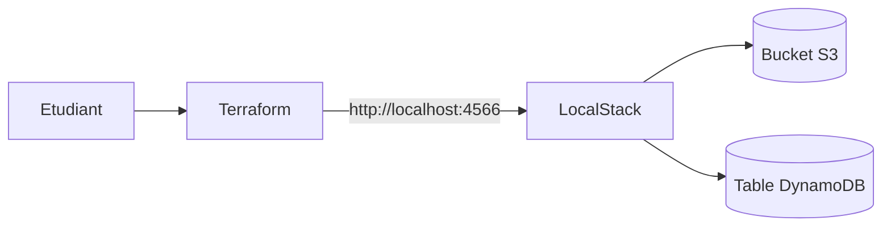

<a id="top"></a>

# Chapitre 1 — Introduction : premier projet Terraform + LocalStack

> **Pré-requis lecture :** [`00-theorie-terraform-localstack.md`](00-theorie-terraform-localstack.md)
>
> Ce document **n'a aucune commande à exécuter**. C'est une introduction au TP 1, pour comprendre ce que vous allez construire et **pourquoi**.

---

## 1. Ce que vous allez construire

À la fin du TP 1, vous aurez sur votre ordinateur :

- un **conteneur Docker** qui héberge LocalStack (un AWS simulé) ;
- un **bucket S3** créé par Terraform dans ce LocalStack ;
- une **table DynamoDB** créée par Terraform dans ce LocalStack ;
- une **structure de projet propre** qui servira de base aux 4 TPs suivants.



Concrètement, vous allez créer cette arborescence :

```text
terraform-localstack-debutant/
├── .env
├── .env.example
├── .gitignore
├── docker-compose.yml
└── terraform/
    ├── provider.tf
    ├── variables.tf
    ├── main.tf
    └── outputs.tf
```

## 2. Pourquoi ce projet ?

Le but pédagogique du TP 1 n'est **pas** simplement « créer un bucket ». C'est d'**ancrer la boucle Terraform** dans votre tête :

```text
Decrire   -> on ecrit du code .tf
Verifier  -> terraform validate, terraform plan
Appliquer -> terraform apply
Constater -> AWS CLI confirme
Detruire  -> terraform destroy
```

Si cette boucle est maîtrisée, **tout le reste du cours en découle** : ajouter une UI (TP 2), ajouter SQS (TP 3), refactoriser en modules (TP 4), multi-environnements (TP 5).

## 3. Quel parcours suivre ?

Deux versions du TP 1 existent, à choisir en fonction de votre situation. Lisez [`00-theorie-terraform-localstack.md`](00-theorie-terraform-localstack.md#choix) si vous hésitez.

| Vous êtes… | Lisez et faites… |
|---|---|
| Étudiant·e avec GitHub Education vérifié | [`01b-...md`](01b-Chapitre1-Pratique-01-terraform-localstack.md) (plan Student) |
| Personne sans compte LocalStack, démo rapide | [`01c-...-hobby-no-token.md`](01c-Chapitre1-Pratique-01-terraform-localstack-hobby-no-token.md) (bypass) |
| Pro / future formation pérenne | [`01b-...md`](01b-Chapitre1-Pratique-01-terraform-localstack.md) (plan Hobby ou Student) |

> Le code Terraform du TP 1 est **identique** dans les deux versions. Seule la configuration de LocalStack (token vs bypass) change.

## 4. Compétences visées (apprentissage)

À la fin de ce chapitre vous serez capable de :

- Démarrer et arrêter LocalStack via Docker Compose.
- Écrire un fichier `provider.tf` qui redirige le provider AWS vers LocalStack.
- Déclarer une `resource` S3 et une `resource` DynamoDB en HCL.
- Exposer des `output` Terraform et les lire.
- Lancer le cycle `init → fmt → validate → plan → apply` en comprenant chaque étape.
- Vérifier les ressources créées avec AWS CLI.
- Nettoyer proprement avec `terraform destroy`.
- Expliquer **pourquoi** `.env` ne doit pas être commité.

## 5. Compétences NON visées dans ce chapitre

Pour éviter la confusion sur ce qui n'est **pas** au programme du TP 1 :

- ❌ Streamlit / UI (c'est le **TP 2**).
- ❌ SQS (c'est le **TP 3**).
- ❌ Modules Terraform (c'est le **TP 4**).
- ❌ Multi-environnements (c'est le **TP 5**).
- ❌ Déploiement sur le vrai AWS.
- ❌ Backends Terraform distants (S3 backend, Terraform Cloud…).

## 6. Temps estimé

| Phase | Durée |
|---|---|
| Préparation environnement (Docker, Terraform, AWS CLI installés) | ~30 min |
| Création compte LocalStack et token (version `b` uniquement) | ~15 min |
| Création projet + fichiers de config | ~30 min |
| Démarrage LocalStack + vérification | ~10 min |
| Code Terraform (`provider`, `main`, `outputs`) | ~45 min |
| Cycle Terraform + AWS CLI | ~30 min |
| Mini-rapport | ~30 min |
| **Total** | **~3 h** |

## 7. Ce dont vous aurez besoin

- Docker Desktop installé et démarré (icône verte).
- Terraform ≥ 1.6 installé (`terraform --version`).
- AWS CLI v2 installé (`aws --version`).
- VS Code (ou autre éditeur).
- Un terminal (PowerShell, Git Bash, ou bash).
- Pour la version `b` : un compte LocalStack gratuit + un Auth Token.
- Pour la version `c` : rien d'autre que Docker.

## 8. Comment lire le TP qui suit

Le fichier `01b-...md` (ou `01c-...md`) est structuré en **22 parties courtes**. Chaque partie a :

- un **titre** clair (« Partie VI — Créer le fichier `.env` ») ;
- un ou plusieurs **détails dépliables** (avec `<details>...`) ;
- un **encadré récapitulatif** quand c'est pertinent ;
- un **lien retour en haut** à la fin.

**Conseil :** travaillez **une partie à la fois**. Ne sautez pas les vérifications intermédiaires : un échec en partie III est plus facile à diagnostiquer qu'un échec mystérieux en partie XVI.

## 9. Que faire si vous êtes bloqué ?

1. Relisez la partie courante en entier.
2. Consultez la **Partie XX (Erreurs fréquentes)** du TP.
3. Comparez votre projet avec `solutions/tp1/` (version `b`) ou `solutions/tp1c/` (version `c`).
4. Vérifiez que Docker Desktop tourne (`docker info`).
5. Vérifiez que LocalStack répond : `curl http://localhost:4566/_localstack/info`.

---

> **Prêt ?** Ouvrez l'un de ces deux fichiers selon votre parcours :
> - [`01b-Chapitre1-Pratique-01-terraform-localstack.md`](01b-Chapitre1-Pratique-01-terraform-localstack.md) — version avec token (Student/Hobby).
> - [`01c-Chapitre1-Pratique-01-terraform-localstack-hobby-no-token.md`](01c-Chapitre1-Pratique-01-terraform-localstack-hobby-no-token.md) — version sans token (bypass legacy).

<p align="right"><a href="#top">↑ Retour en haut</a></p>
