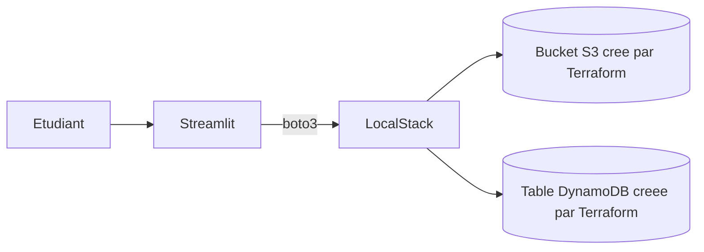

<a id="top"></a>

# Chapitre 2 — Théorie : ajouter une UI Streamlit pour valider Terraform

> **Pré-requis :** avoir terminé le TP 1 (parcours `b` ou `c`).
>
> Ce document est une **théorie préparatoire** au TP 2. Aucune commande à exécuter ici.

---

## 1. Ce que vous allez construire

Vous allez **ajouter une interface Streamlit** au projet du TP 1. L'application n'invente **aucune ressource** : elle se contente de **lire et valider** ce que Terraform a déjà créé.



À la fin du TP 2, votre projet ressemblera à ceci :

```text
terraform-localstack-debutant/
├── .env / .env.example / .gitignore
├── docker-compose.yml
├── requirements.txt          NOUVEAU
├── app.py                    NOUVEAU
└── terraform/                (inchange depuis TP 1)
```

## 2. Pourquoi ajouter une UI ?

AWS CLI est suffisant pour vérifier des ressources, mais :

```text
- L'UI rend les ressources "tangibles" pour le debutant.
- Elle force a reflechir au lien entre `.env` et `terraform output`.
- Elle prepare a l'integration avec une vraie app (TP 3+).
```

**Règle d'or :** Streamlit **ne doit pas créer** d'infrastructure. Si une ressource n'est pas dans Terraform, elle n'existe pas pour l'app.

## 3. Compétences visées

- Créer un environnement virtuel Python (`venv`).
- Lister les dépendances dans `requirements.txt`.
- Lire les outputs Terraform en JSON depuis Python.
- Utiliser `boto3` pour parler à LocalStack.
- Comprendre la séparation **infrastructure (Terraform)** vs **application (Streamlit)**.

## 4. Quel parcours suivre ?

Comme pour le TP 1, deux versions existent :

| Vous avez fait le TP 1 en… | Faites le TP 2 en… |
|---|---|
| `01b` (avec token) | [`02b-...md`](02b-Chapitre2-Pratique-02-terraform-localstack-ajout-ui.md) |
| `01c` (bypass) | [`02c-...-hobby-no-token.md`](02c-Chapitre2-Pratique-02-terraform-localstack-ajout-ui-hobby-no-token.md) |

> Ne changez pas de parcours en cours de route.

## 5. Temps estimé

| Phase | Durée |
|---|---|
| Mise à jour `.env` avec les outputs Terraform | ~15 min |
| Création venv + installation dépendances | ~15 min |
| Coder `app.py` (4 pages) | ~1 h 30 |
| Tester les 4 pages | ~30 min |
| Mini-rapport | ~30 min |
| **Total** | **~3 h** |

## 6. Ce que vous n'allez PAS faire ici

- ❌ Ajouter SQS (c'est le TP 3).
- ❌ Refactoriser Terraform en modules (TP 4).
- ❌ Multi-environnements (TP 5).
- ❌ Déployer Streamlit en production.

---

> **Prêt ?** Ouvrez :
> - [`02b-Chapitre2-Pratique-02-terraform-localstack-ajout-ui.md`](02b-Chapitre2-Pratique-02-terraform-localstack-ajout-ui.md) — version avec token.
> - [`02c-Chapitre2-Pratique-02-terraform-localstack-ajout-ui-hobby-no-token.md`](02c-Chapitre2-Pratique-02-terraform-localstack-ajout-ui-hobby-no-token.md) — version sans token.

<p align="right"><a href="#top">↑ Retour en haut</a></p>
