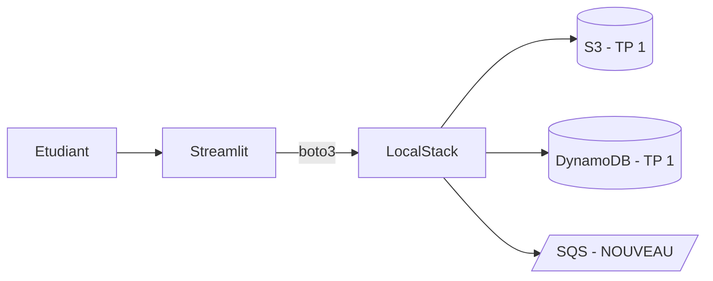

<a id="top"></a>

# Chapitre 3 — Introduction : ajouter SQS au projet

> **Pré-requis :** avoir terminé les TPs 1 et 2 (parcours `b` ou `c`).
>
> Document théorique. Aucune commande à exécuter ici.

---

## 1. Ce que vous allez construire

Vous allez **ajouter une file SQS** à l'infrastructure existante, puis l'utiliser dans Streamlit pour envoyer, recevoir et supprimer des messages.



Trois fichiers Terraform sont modifiés :

```text
terraform/
├── main.tf       + aws_sqs_queue.notifications
├── outputs.tf    + sqs_queue_name, sqs_queue_url
└── variables.tf  + owner_name (utilise dans les tags)
```

Et une page Streamlit est ajoutée :

```text
app.py (ou pages/4_SQS.py selon votre structure)
```

## 2. Pourquoi SQS ?

SQS (Simple Queue Service) introduit une **logique asynchrone** :

```text
Un service "envoie" un message.
Un autre service "lit" et "traite" ce message plus tard.
```

C'est l'occasion d'apprendre :

- Les **listes ordonnées de messages** dans AWS.
- La notion de **MessageId**, **ReceiptHandle**, **visibility timeout**.
- Pourquoi pour SQS on a besoin de **deux outputs** (`name` ET `url`).

## 3. Compétences visées

- Ajouter une **nouvelle ressource** dans un projet Terraform existant.
- Ajouter des **outputs** correspondants.
- Mettre à jour `.env` à partir des nouveaux outputs.
- Appeler les méthodes SQS de `boto3` : `send_message`, `receive_message`, `delete_message`.
- Comprendre la différence entre **lire** et **consommer** un message.

## 4. Quel parcours suivre ?

| Vous avez fait le TP 2 en… | Faites le TP 3 en… |
|---|---|
| `02b` | [`03b-...md`](03b-Chapitre3-Pratique-03-ajouter-sqs-terraform-validation-streamlit.md) |
| `02c` | [`03c-...-hobby-no-token.md`](03c-Chapitre3-Pratique-03-ajouter-sqs-terraform-validation-streamlit-hobby-no-token.md) |

## 5. Temps estimé

| Phase | Durée |
|---|---|
| Lecture intro + relecture TP 2 | ~15 min |
| Ajouter `aws_sqs_queue` et ses outputs | ~30 min |
| `terraform plan` + `apply` | ~15 min |
| Mettre à jour `.env` avec `SQS_QUEUE_URL` | ~10 min |
| Ajouter la page SQS dans Streamlit | ~45 min |
| Tester send/receive/delete | ~30 min |
| Mini-rapport | ~30 min |
| **Total** | **~2 h 30** |

## 6. Concepts SQS à connaître

| Terme | Définition |
|---|---|
| **Queue** | File de messages FIFO ou non, en attente de lecture. |
| **Producer** | Code qui envoie des messages (`send_message`). |
| **Consumer** | Code qui lit et traite des messages (`receive_message`). |
| **MessageId** | Identifiant unique du message. |
| **ReceiptHandle** | Jeton temporaire requis pour supprimer un message lu. |
| **Visibility timeout** | Période pendant laquelle un message lu est invisible aux autres consumers. |

## 7. Ce que vous n'allez PAS faire ici

- ❌ Refactor en modules (c'est le TP 4).
- ❌ Multi-environnements (TP 5).
- ❌ Configurer DLQ (Dead Letter Queue).
- ❌ Lambda triggers SQS (hors scope cours).

---

> **Prêt ?** Ouvrez :
> - [`03b-Chapitre3-Pratique-03-ajouter-sqs-terraform-validation-streamlit.md`](03b-Chapitre3-Pratique-03-ajouter-sqs-terraform-validation-streamlit.md) — version avec token.
> - [`03c-Chapitre3-Pratique-03-ajouter-sqs-terraform-validation-streamlit-hobby-no-token.md`](03c-Chapitre3-Pratique-03-ajouter-sqs-terraform-validation-streamlit-hobby-no-token.md) — version sans token.

<p align="right"><a href="#top">↑ Retour en haut</a></p>
