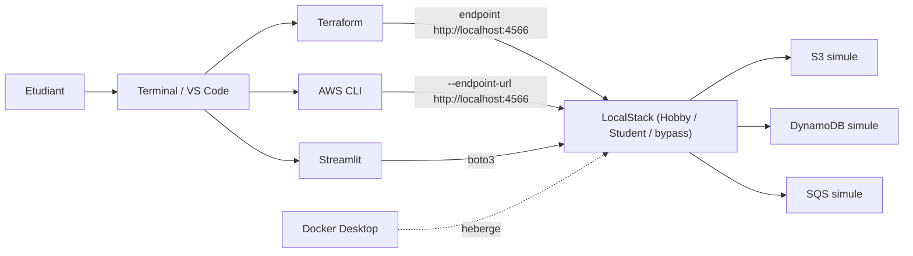

<a id="top"></a>

# Cours guidé — Terraform avec LocalStack

> **Public visé :** étudiants débutants en Infrastructure as Code, Cloud, DevOps
>
> **Niveau :** débutant complet à débutant avancé
>
> **Durée totale estimée :** ~20 heures (5 TPs de 3 à 6 h)
>
> **Deux parcours au choix :** `b` (plan Student/Hobby avec Auth Token, pérenne) ou `c` (bypass legacy sans compte ni token, jusqu'au 6 nov. 2026)
>
> **Mode de travail :** individuel ou en binôme
>
> **Langue du cours :** français

---

## Sommaire

1. [À qui s'adresse ce cours ?](#a-qui)
2. [Ce que vous saurez faire à la fin](#objectifs)
3. [Architecture pédagogique](#architecture)
4. [Prérequis logiciels](#prerequis)
5. [Structure des fichiers du cours](#structure)
6. [Plan du cours — théorie + 5 TPs](#plan)
7. [Quel parcours choisir : `b` ou `c` ?](#parcours)
8. [Comment travailler ce cours](#methode)
9. [Conventions du cours](#conventions)
10. [Dépannage rapide](#depannage)
11. [Cheat sheet — commandes utiles](#cheatsheet)
12. [Références utiles](#references)
13. [Roadmap & évolutions](#roadmap)

---

<a id="a-qui"></a>

## À qui s'adresse ce cours ?

Ce cours s'adresse à toute personne qui souhaite apprendre Terraform et l'Infrastructure as Code **sans avoir à créer un compte AWS payant et sans risquer de coûts**.

Toutes les ressources sont créées dans **LocalStack**, un environnement qui simule AWS localement dans un conteneur Docker. Le code Terraform que vous écrirez ici fonctionne quasi à l'identique avec le vrai AWS : ce que vous apprenez est transférable.

> **Important — changement LocalStack 2026 :** depuis le 23 mars 2026, LocalStack exige normalement un **Auth Token** au démarrage. Voir [`00-theorie-terraform-localstack.md`](00-theorie-terraform-localstack.md) pour comprendre les plans disponibles et choisir votre parcours.

**Prérequis pédagogiques :**

- Savoir ouvrir un terminal (PowerShell, Bash ou Terminal macOS).
- Savoir créer un dossier et un fichier texte.
- Notions minimales de ligne de commande (`cd`, `ls`, `mkdir`).
- Aucune connaissance préalable de Terraform, Docker ou AWS n'est requise.

---

<a id="objectifs"></a>

## Ce que vous saurez faire à la fin

À la fin des 5 TPs, vous serez capable de :

- Décrire une infrastructure AWS en **code HCL** avec Terraform.
- Utiliser **Docker Compose** pour démarrer un service local.
- Configurer un **provider AWS** redirigé vers LocalStack.
- Créer et détruire des ressources **S3**, **DynamoDB** et **SQS** avec `terraform apply` / `terraform destroy`.
- Valider visuellement une infrastructure avec une application **Streamlit** en Python.
- Organiser un projet Terraform en **modules réutilisables**.
- Gérer **plusieurs environnements** (`dev`, `test`) avec un même code.
- Diagnostiquer les erreurs Terraform et Docker les plus courantes.

---

<a id="architecture"></a>

## Architecture pédagogique



**Logique générale :**

- **Terraform** est la source de vérité de l'infrastructure (TPs 1, 3, 4, 5).
- **LocalStack** est le « faux AWS » qui tourne dans Docker.
- **Streamlit** est un outil de validation visuelle (TPs 2, 3, 4, 5).
- **AWS CLI** sert à vérifier les ressources en ligne de commande.

---

<a id="prerequis"></a>

## Prérequis logiciels

À installer **avant de commencer le TP 1** :

| Outil | Vérification | Lien d'installation |
|---|---|---|
| **Docker Desktop** | `docker --version` | https://www.docker.com/products/docker-desktop |
| **Docker Compose v2** | `docker compose version` | inclus avec Docker Desktop |
| **Terraform ≥ 1.6** | `terraform version` | https://developer.hashicorp.com/terraform/install |
| **AWS CLI v2** | `aws --version` | https://docs.aws.amazon.com/cli/latest/userguide/getting-started-install.html |
| **Python ≥ 3.10** (TP 2+) | `python --version` | https://www.python.org/downloads/ |
| **VS Code** | éditeur recommandé | https://code.visualstudio.com/ |

> **Important :** Docker Desktop doit être **démarré** (icône verte) avant chaque session de travail. C'est la cause la plus fréquente des erreurs « cannot connect to Docker daemon ».

### Compte LocalStack (parcours `b` uniquement)

Si vous choisissez le **parcours `b`** :

- Créer un compte gratuit sur https://app.localstack.cloud/sign-up
- Choisir le plan **Hobby** (gratuit, immédiat) ou demander le plan **Student** (gratuit, via vérification GitHub Education)
- Récupérer son **Auth Token** dans `app.localstack.cloud` → `Auth Tokens`
- Procédure détaillée : [`01b-...md` — Partie IV](01b-Chapitre1-Pratique-01-terraform-localstack.md#partie-4)

Si vous choisissez le **parcours `c`** : aucun compte requis, juste Docker.

Aucun compte AWS n'est nécessaire dans les deux cas.

---

<a id="structure"></a>

## Structure des fichiers du cours

```text
terraform-with-localstack-main/
├── README.md                                       (ce fichier)
│
├── 00-theorie-terraform-localstack.md              theorie : Terraform + plans LocalStack
│
├── 01a-introduction-Chapitre1.md                   intro chapitre 1
├── 01b-Chapitre1-Pratique-01-...md                 TP 1 avec token
├── 01c-Chapitre1-Pratique-01-...-hobby-no-token.md TP 1 sans token (bypass)
│
├── 02a-introduction-Chapitre2.md                   intro chapitre 2
├── 02b-...md                                       TP 2 avec token
├── 02c-...-hobby-no-token.md                       TP 2 sans token
│
├── 03a-...md, 03b-...md, 03c-...md                 chapitre 3
├── 04a-...md, 04b-...md, 04c-...md                 chapitre 4
├── 05a-...md, 05b-...md, 05c-...md                 chapitre 5
│
└── solutions/                                      projets de reference executables
    ├── README.md
    ├── tp1/  ... tp5/                              solutions parcours 'b'
    └── tp1c/ ... tp5c/                             solutions parcours 'c'
```

### Légende des suffixes

| Suffixe | Sens |
|---|---|
| `Na-` | Introduction théorique du chapitre N (commune aux deux parcours) |
| `Nb-` | TP pratique du chapitre N, parcours **avec Auth Token** (plans Hobby / Student) |
| `Nc-` | TP pratique du chapitre N, parcours **sans token** (bypass legacy, jusqu'au 6 nov. 2026) |

---

<a id="plan"></a>

## Plan du cours — théorie + 5 TPs

### Document de théorie

| Fichier | Sujet |
|---|---|
| [`00-theorie-terraform-localstack.md`](00-theorie-terraform-localstack.md) | Qu'est-ce que Terraform ? Qu'est-ce que LocalStack ? Tableau des plans 2026 (Hobby, Student, Base, Ultimate, Enterprise) avec colonne « Token requis ? » |

### Les 5 TPs

| # | Chapitre | Intro (commune) | Version `b` (token) | Version `c` (sans token) |
|---:|---|---|---|---|
| 1 | Terraform + LocalStack (S3, DynamoDB) | [`01a-...md`](01a-introduction-Chapitre1.md) | [`01b-...md`](01b-Chapitre1-Pratique-01-terraform-localstack.md) | [`01c-...md`](01c-Chapitre1-Pratique-01-terraform-localstack-hobby-no-token.md) |
| 2 | Dashboard Streamlit | [`02a-...md`](02a-introduction-Chapitre2.md) | [`02b-...md`](02b-Chapitre2-Pratique-02-terraform-localstack-ajout-ui.md) | [`02c-...md`](02c-Chapitre2-Pratique-02-terraform-localstack-ajout-ui-hobby-no-token.md) |
| 3 | Ajouter SQS | [`03a-...md`](03a-introduction-Chapitre3.md) | [`03b-...md`](03b-Chapitre3-Pratique-03-ajouter-sqs-terraform-validation-streamlit.md) | [`03c-...md`](03c-Chapitre3-Pratique-03-ajouter-sqs-terraform-validation-streamlit-hobby-no-token.md) |
| 4 | Modules Terraform | [`04a-...md`](04a-introduction-Chapitre4.md) | [`04b-...md`](04b-Chapitre4-Pratique-04-modules-terraform-validation-streamlit.md) | [`04c-...md`](04c-Chapitre4-Pratique-04-modules-terraform-validation-streamlit-hobby-no-token.md) |
| 5 | Multi-environnements dev / test | [`05a-...md`](05a-introduction-Chapitre5.md) | [`05b-...md`](05b-Chapitre5-Pratique-05-environnements-dev-test-terraform-validation-streamlit.md) | [`05c-...md`](05c-Chapitre5-Pratique-05-environnements-dev-test-terraform-validation-streamlit-hobby-no-token.md) |

### Progression conceptuelle

```mermaid
flowchart LR
    Th["00 - Theorie"] --> Ch1a["01a - intro"]
    Ch1a --> Ch1["TP 1 (b ou c)"]
    Ch1 --> Ch2a["02a - intro"]
    Ch2a --> Ch2["TP 2 (b ou c)"]
    Ch2 --> Ch3a["03a - intro"]
    Ch3a --> Ch3["TP 3 (b ou c)"]
    Ch3 --> Ch4a["04a - intro"]
    Ch4a --> Ch4["TP 4 (b ou c)"]
    Ch4 --> Ch5a["05a - intro"]
    Ch5a --> Ch5["TP 5 (b ou c)"]
```



> **Solutions de référence :** dossier [`solutions/`](solutions/) avec un projet autonome par TP, en versions `b` (`tp1/` à `tp5/`) et `c` (`tp1c/` à `tp5c/`).

---

<a id="parcours"></a>

## Quel parcours choisir : `b` ou `c` ?

| Critère | Parcours `b` (token) | Parcours `c` (bypass) |
|---|---|---|
| Compte LocalStack à créer | Oui | **Non** |
| Auth Token à gérer | Oui | **Non** |
| Démarrage en < 2 min | Difficile | **Oui** |
| Pérenne après le 6 nov. 2026 | **Oui** | Non |
| Apprend la gestion des secrets (`.env`) | **Oui (réaliste)** | Allégé |
| Représentatif d'un projet pro | **Oui** | Non |

**Recommandations :**

- **Cours en classe / formation longue → parcours `b`** (réaliste, pérenne, on apprend à manipuler des secrets).
- **Démo rapide / atelier 1h / pas de compte LocalStack → parcours `c`** (zero setup, à condition de finir avant le 6 nov. 2026).
- **Étudiant avec GitHub Education vérifié → parcours `b` plan Student** (totalement gratuit, futur-proof).

Pour les détails complets : [`00-theorie-terraform-localstack.md`](00-theorie-terraform-localstack.md#choix).

> **Règle d'or :** ne pas changer de parcours en cours de route. Si vous démarrez en `b`, finissez en `b`.

---

<a id="methode"></a>

## Comment travailler ce cours

### Ordre obligatoire

1. Lire [`00-theorie-terraform-localstack.md`](00-theorie-terraform-localstack.md) en entier.
2. Pour chaque chapitre N (de 1 à 5) : lire `Na-...md`, puis faire `Nb-...md` **ou** `Nc-...md` selon votre parcours.
3. Faire les TPs **dans l'ordre 1 → 2 → 3 → 4 → 5**. Chaque TP s'appuie sur l'état du projet construit dans le précédent.

### Pour chaque TP

1. **Lire l'intégralité du TP** avant de taper la première commande (10 min de lecture économisent 1 h de blocage).
2. **Suivre étape par étape**, sans sauter les vérifications (`docker ps`, `curl /info`, `terraform plan`).
3. **Prendre les captures d'écran demandées** au fur et à mesure, pas à la fin.
4. **Toujours faire `terraform plan` avant `terraform apply`**.
5. **Toujours faire `terraform destroy` puis `docker compose down`** à la fin de la session.
6. **Répondre aux questions de compréhension** et rédiger le mini-rapport.

### Livrables par TP

- Dossier de projet complet (sans `.terraform/`, sans `.tfstate`, sans `volume/`, sans `.env`).
- Captures d'écran (listées dans chaque TP).
- Mini-rapport (modèle dans chaque TP, Partie « Mini-rapport »).
- Code commité dans Git si demandé par l'enseignant.

---

<a id="conventions"></a>

## Conventions du cours

### Encadrés

Vous croiserez dans tous les TPs ces conventions visuelles :

| Encadré | Sens |
|---|---|
| `> **Objectif :** …` | But de la partie |
| `> **Astuce :** …` | Bon réflexe à prendre |
| `> **Attention :** …` | Erreur fréquente à éviter |
| `> **Pourquoi ?**` | Justification pédagogique |
| `<details><summary>…</summary>` | Bloc repliable (cliquez pour ouvrir) |

### Blocs de commandes

- Les blocs `bash` fonctionnent dans **Bash, Git Bash, WSL, macOS Terminal**.
- Les blocs `powershell` sont à utiliser dans **Windows PowerShell ou Windows Terminal**.
- Quand les deux variantes existent, **utilisez celle qui correspond à votre système**.

```bash
ls -la
```

```powershell
Get-ChildItem -Force
```

### Fichiers du projet (à la fin du cours)

```text
terraform-localstack-debutant/
├── .env
├── .env.example
├── .gitignore
├── docker-compose.yml
├── streamlit_app/         (a partir du TP 2)
│   ├── app.py
│   ├── pages/
│   └── requirements.txt
└── terraform/
    ├── provider.tf
    ├── variables.tf
    ├── main.tf
    ├── outputs.tf
    ├── modules/          (a partir du TP 4)
    │   ├── s3/
    │   ├── dynamodb/
    │   └── sqs/
    └── environments/     (a partir du TP 5)
        ├── dev/
        └── test/
```

---

<a id="depannage"></a>

## Dépannage rapide

Les erreurs les plus fréquentes sont détaillées **dans la partie « Erreurs fréquentes » de chaque TP**.

| Symptôme | Vérifier en priorité | Détaillé dans |
|---|---|---|
| `cannot connect to the Docker daemon` | Docker Desktop est-il démarré ? | [TP 1b — Partie XX](01b-Chapitre1-Pratique-01-terraform-localstack.md#partie-20) / [TP 1c — Partie XX](01c-Chapitre1-Pratique-01-terraform-localstack-hobby-no-token.md#partie-20) |
| `LOCALSTACK_AUTH_TOKEN is required` (parcours `b`) | `.env` est-il bien rempli ? | [TP 1b — Partie XX](01b-Chapitre1-Pratique-01-terraform-localstack.md#partie-20) |
| `Bypass legacy requis dans .env` (parcours `c`) | `LOCALSTACK_ACKNOWLEDGE_ACCOUNT_REQUIREMENT=1` dans `.env` ? | [TP 1c — Partie XX](01c-Chapitre1-Pratique-01-terraform-localstack-hobby-no-token.md#partie-20) |
| `port is already allocated` (4566) | Un autre conteneur LocalStack tourne déjà | TP 1 — Partie XX |
| Terraform appelle le vrai AWS | Bloc `endpoints` manquant dans `provider.tf` | TP 1 — Partie XX |
| `aws ... Unable to locate credentials` | Lancer `aws configure` (valeurs `test` / `test`) | TP 1 — Partie XX |
| `BucketAlreadyExists` | Changer `project_name` dans `variables.tf` | TP 1 — Partie XX |
| `terraform plan` ne montre rien | Vérifier que `terraform init` a été fait | TP 1 — Partie XVII |

---

<a id="cheatsheet"></a>

## Cheat sheet — commandes utiles

### Docker / Docker Compose

```bash
docker compose up -d              # demarre LocalStack en arriere-plan
docker compose down               # arrete LocalStack
docker compose down -v            # arrete + supprime le volume
docker compose config             # affiche la config resolue
docker compose logs -f localstack # suit les logs
docker ps                         # liste les conteneurs actifs
```

### Terraform (à exécuter dans `terraform/`)

```bash
terraform init                # prepare le projet, telecharge les providers
terraform fmt                 # formate les .tf
terraform validate            # verifie la syntaxe
terraform plan                # montre ce qui va etre cree / detruit
terraform apply               # applique le plan (demande yes)
terraform destroy             # detruit toutes les ressources (demande yes)
terraform output              # affiche les valeurs des outputs
```

### AWS CLI sur LocalStack

```bash
aws --endpoint-url=http://localhost:4566 s3 ls
aws --endpoint-url=http://localhost:4566 s3 cp fichier.txt s3://mon-bucket/
aws --endpoint-url=http://localhost:4566 dynamodb list-tables
aws --endpoint-url=http://localhost:4566 sqs list-queues
```

### Vérifier que LocalStack répond

```bash
curl http://localhost:4566/_localstack/info
curl http://localhost:4566/_localstack/health
```

---

<a id="references"></a>

## Références utiles

- **Théorie du cours** : [`00-theorie-terraform-localstack.md`](00-theorie-terraform-localstack.md)
- **Terraform** : https://developer.hashicorp.com/terraform/docs
- **Terraform — provider AWS** : https://registry.terraform.io/providers/hashicorp/aws/latest/docs
- **LocalStack — Plans & tarification** : https://www.localstack.cloud/pricing
- **LocalStack — Auth Token** : https://docs.localstack.cloud/aws/getting-started/auth-token/
- **LocalStack — Annonce changements 2026** : https://blog.localstack.cloud/2026-upcoming-pricing-changes/
- **LocalStack — Getting Started** : https://docs.localstack.cloud/getting-started/
- **LocalStack — Installation Docker** : https://docs.localstack.cloud/getting-started/installation/
- **LocalStack — Terraform** : https://docs.localstack.cloud/user-guide/integrations/terraform/
- **GitHub Education (Student Pack)** : https://education.github.com/
- **Docker Compose — fichier `.env`** : https://docs.docker.com/compose/how-tos/environment-variables/variable-interpolation/
- **AWS CLI — référence** : https://docs.aws.amazon.com/cli/latest/reference/
- **Streamlit — documentation** : https://docs.streamlit.io/

---

<a id="roadmap"></a>

## Roadmap & évolutions

- [x] **Théorie** — document `00-theorie-terraform-localstack.md` créé.
- [x] **Introductions par chapitre** — `01a-...` à `05a-...` créés.
- [x] **Parcours `b`** — TPs 1b à 5b alignés sur le modèle LocalStack 2026 (Hobby / Student avec Auth Token).
- [x] **Parcours `c`** — TPs 1c à 5c créés pour démarrage sans compte (bypass legacy, jusqu'au 6 nov. 2026).
- [x] **Solutions** — projets exécutables `solutions/tp1/`…`solutions/tp5/` (parcours `b`) et `solutions/tp1c/`…`solutions/tp5c/` (parcours `c`).
- [ ] **Après le 6 novembre 2026** — supprimer ou archiver les versions `c` (le bypass cesse de fonctionner).
- [ ] Ajouter un TP 6 optionnel sur Terraform Cloud / les backends distants.
- [ ] Compléter les corrigés des TPs 2 à 5 (au même niveau de détail que le TP 1).

Contributions et corrections bienvenues via Pull Request.

---

*Fin du README — bon courage et bonne pratique de Terraform.*

<p align="right"><a href="#top">↑ Retour en haut</a></p>
