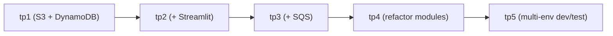
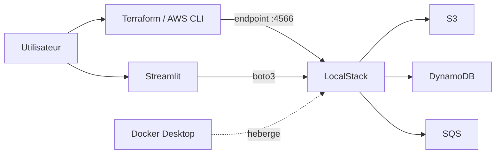

# Solutions des TPs

Ce dossier contient **un projet autonome et exécutable** par TP du cours « Terraform avec LocalStack ». Chaque sous-dossier correspond à l'**état final attendu** du TP, en deux variantes :

- **`tpN/`** : parcours `b` (plan **Hobby** ou **Student** avec **Auth Token**) — pérenne.
- **`tpNc/`** : parcours `c` (bypass legacy `LOCALSTACK_ACKNOWLEDGE_ACCOUNT_REQUIREMENT=1`, **sans token**) — valable jusqu'au **6 novembre 2026**.

> Retour à la page d'accueil du cours : [`../README.md`](../README.md)
>
> Théorie sur les plans LocalStack : [`../00-theorie-terraform-localstack.md`](../00-theorie-terraform-localstack.md)

## Vue d'ensemble — parcours `b` (avec token)

| Dossier | TP corrigé | Contenu | Nouveauté par rapport au TP précédent |
|---|---|---|---|
| [`tp1b/`](tp1b/) | [TP 1b](../01b-Chapitre1-Pratique-01-terraform-localstack.md) | Docker Compose LocalStack, Terraform S3 + DynamoDB | Premier projet |
| [`tp2b/`](tp2b/) | [TP 2b](../02b-Chapitre2-Pratique-02-terraform-localstack-ajout-ui.md) | TP 1 + dashboard Streamlit | Validation visuelle via Streamlit |
| [`tp3b/`](tp3b/) | [TP 3b](../03b-Chapitre3-Pratique-03-ajouter-sqs-terraform-validation-streamlit.md) | TP 2 + SQS | Nouvelle ressource SQS + page Streamlit |
| [`tp4b/`](tp4b/) | [TP 4b](../04b-Chapitre4-Pratique-04-modules-terraform-validation-streamlit.md) | TP 3 refactoré en modules | `modules/s3`, `modules/dynamodb`, `modules/sqs` |
| [`tp5b/`](tp5b/) | [TP 5b](../05b-Chapitre5-Pratique-05-environnements-dev-test-terraform-validation-streamlit.md) | TP 4 multi-env dev / test | `environments/dev` et `environments/test` + sélecteur Streamlit |

## Vue d'ensemble — parcours `c` (sans token, bypass)

| Dossier | TP corrigé | Contenu |
|---|---|---|
| [`tp1c/`](tp1c/) | [TP 1c](../01c-Chapitre1-Pratique-01-terraform-localstack-hobby-no-token.md) | Identique à `tp1b/`, mais `.env` et `docker-compose.yml` adaptés au bypass |
| [`tp2c/`](tp2c/) | [TP 2c](../02c-Chapitre2-Pratique-02-terraform-localstack-ajout-ui-hobby-no-token.md) | Identique à `tp2b/`, mais bypass |
| [`tp3c/`](tp3c/) | [TP 3c](../03c-Chapitre3-Pratique-03-ajouter-sqs-terraform-validation-streamlit-hobby-no-token.md) | Identique à `tp3b/`, mais bypass |
| [`tp4c/`](tp4c/) | [TP 4c](../04c-Chapitre4-Pratique-04-modules-terraform-validation-streamlit-hobby-no-token.md) | Identique à `tp4b/`, mais bypass |
| [`tp5c/`](tp5c/) | [TP 5c](../05c-Chapitre5-Pratique-05-environnements-dev-test-terraform-validation-streamlit-hobby-no-token.md) | Identique à `tp5b/`, mais bypass |

> **Différence concrète entre `tpN/` et `tpNc/` :** uniquement `.env.example` et `docker-compose.yml`. Tout le reste (Terraform, Python, structure) est **identique**.

## Structure progressive (même progression pour les deux parcours)

## Comment utiliser ces solutions ?

### Pour l'étudiant

- **Bloqué sur un TP ?** Ouvrez `solutions/tpN/` (ou `tpNc/` selon votre parcours) et comparez votre projet au corrigé.
- **Reprendre depuis un état stable ?** Copiez le dossier ailleurs et continuez à partir de là.
- **Comparer deux étapes ?** Faites un diff entre `solutions/tp(N-1)/` et `solutions/tpN/` (ou versions `c`).

### Pour l'enseignant

- **Démonstration en classe** : `cd solutions/tpN && docker compose up -d && cd terraform && terraform init && terraform apply`.
- **Correction** : référence claire de ce qui doit fonctionner à la fin du TP.

## Prérequis communs

- Docker Desktop (démarré)
- Terraform ≥ 1.6
- AWS CLI v2 (TPs 1+)
- Python ≥ 3.10 (TPs 2+)

Selon le parcours :

| Parcours | Compte LocalStack | Auth Token | `.env` à compléter |
|---|---|---|---|
| `b` (`tpN/`) | Requis | Requis | `LOCALSTACK_AUTH_TOKEN=...` |
| `c` (`tpNc/`) | **Non requis** | **Non requis** | `LOCALSTACK_ACKNOWLEDGE_ACCOUNT_REQUIREMENT=1` (déjà dans `.env.example`) |

Chaque sous-dossier contient un `.env.example` à recopier en `.env` (et à compléter avec votre token pour le parcours `b`).

## Schéma commun à tous les TPs

## Limites des solutions

- Le fichier `.env` réel n'est **jamais committé** : seul `.env.example` est fourni.
- Les `.tfstate` ne sont **pas** commités : il faut exécuter `terraform apply` localement avant de manipuler Streamlit.
- Les noms de ressources utilisent `project_name = "tp-localstack"` par convention.
- **Date butoir parcours `c` : 6 novembre 2026.** Après cette date, supprimez les dossiers `tpNc/` ou basculez vers `tpN/`.

## Si une solution ne démarre pas

1. Docker Desktop est-il démarré ? (`docker info`)
2. Le `.env` contient-il la bonne variable selon le parcours ?
   - Parcours `b` : `LOCALSTACK_AUTH_TOKEN=...`
   - Parcours `c` : `LOCALSTACK_ACKNOWLEDGE_ACCOUNT_REQUIREMENT=1`
3. LocalStack répond-il ? (`curl http://localhost:4566/_localstack/info`)
4. `terraform apply` a-t-il bien été exécuté dans le bon dossier ?
5. L'environnement Python virtuel est-il activé (TPs 2+) ?

Pour les erreurs détaillées, voir la section « Dépannage rapide » du [README du cours](../README.md#depannage).
